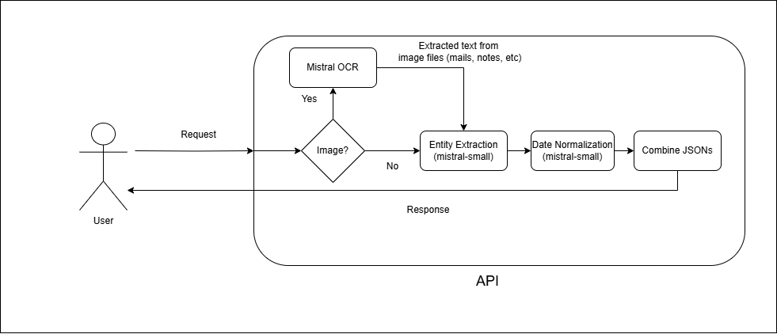

# Appointment Scheduler API

An API service that parses appointment details using **Mistral AI OCR + LLM models**.
Built with **Node.js** and deployed via **Docker** on **Azure VM**.

---
## Demo Video
https://drive.google.com/file/d/1z93tvYEkx1bvGXRlAUOXA4tyaH95OcPL/view?usp=sharing


## Architecture


---

## Testing API using Postman

### 1. Using text data
**Method:** `POST`

* **URL:**

  ```
  http://4.187.157.140:3000:3000/appointment/parse
  ```


* **Headers:**

  ```
  Content-Type: application/json
  ```

* **Body (raw → JSON):**

  ```json
  {
    "text": "Appointment with Dr. Ramesh at Apollo Hospitals on 27th September at 5 PM"
  }
  ```
### 2. Using image data
**Method:** `POST`

* **URL:**

  ```
  http://4.187.157.140:3000:3000/appointment/parse
  ```

  (same endpoint, OCR will trigger if image is provided)

* **Body (form-data):**

  | Key     | Type | Value                       |
  | ------- | ---- | --------------------------- |
  | `image` | File | `appointment.png`           |
  | `tz`    | Text | `Asia/Kolkata` *(optional)* |

## ⚙️ Setup Instructions

### Local Setup

1. Clone repo:

   ```bash
   git clone https://github.com/pranav-85/scheduling_assistant.git
   cd appointment-scheduler/api
   ```
2. Install dependencies:

   ```bash
   npm install
   ```
3. Create an .env file:

   ```bash
   MISTRAL_API_KEY="api_key_here"
   ```
4. Start the server:

   ```bash
   node server.js
   ```
5. Visit:

   ```
   http://localhost:3000
   ```

---

### Docker Setup

1. Build the Docker image:

   ```bash
   sudo docker build -t app .
   ```
2. Run container:

   ```bash
   sudo docker run -d -p 3000:3000 -e MISTRAL_API_KEY="your_api_key_here" app
   ```
3. View logs:

   ```bash
   sudo docker logs <container_id>
   ```

---

### Azure VM Deployment

1. SSH into your VM:

   ```bash
   ssh azureuser@<vm-ip>
   ```
2. Copy your project files (or pull from GitHub):

   ```bash
   git clone https://github.com/pranav-85/scheduling_assistant.git
   ```
3. Build and run with Docker:

   ```bash
   sudo docker build -t app .
   sudo docker run -d -p 3000:3000 -e MISTRAL_API_KEY="your_api_key_here" app
   ```
4. Allow port `3000` in Azure Network Security Group (NSG).
   Now you can access:

   ```
   http://<vm-public-ip>:3000
   ```
---

## ⚠️ Troubleshooting

* **401 Unauthorized** → Check if `MISTRAL_API_KEY` is set correctly inside Docker:

  ```bash
  sudo docker exec -it <container_id> printenv MISTRAL_API_KEY
  ```
* **Timeout** → Ensure VM/container has internet + port 3000 open.
* **Port in use** → Run on another port:

  ```bash
  sudo docker run -d -p 8080:3000 -e MISTRAL_API_KEY="..." app
  ```
